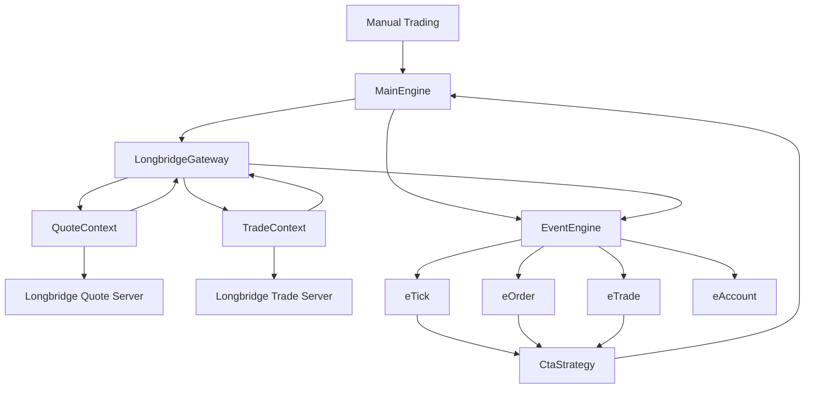
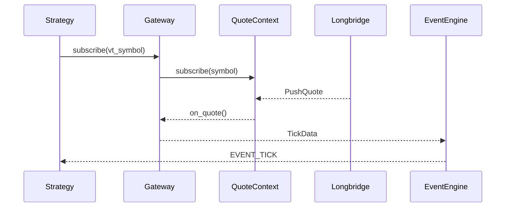

# 个人登陆信息（秘）

## 配置Longbridge Developers认证方式一：OAuth 2.0（推荐）
执行以下命令注册 OAuth 客户端，获取 client_id：
```shell
$body = @{
    redirect_uris                = @("http://localhost:60355/callback")
    token_endpoint_auth_method   = "none"
    grant_types                  = @("authorization_code", "refresh_token")
    response_types               = @("code")
    client_name                  = "My Longbridge OpenAPI"
} | ConvertTo-Json

Invoke-RestMethod -Method POST `
    -Uri "https://openapi.longbridge.com/oauth2/register" `
    -ContentType "application/json" `
    -Body $body
```
响应示例：
```json
{
  "client_id": "72d9caaf-0bd4-4000-85a7-8c7978c74544",
  "client_id_issued_at": 1773311221,
  "client_secret_expires_at": 1773314821,
  "client_name": "My Longbridge OpenAPI",
  "redirect_uris": ["http://localhost:60355/callback"],
  "grant_types": ["authorization_code", "refresh_token"],
  "token_endpoint_auth_method": "none",
  "response_types": ["code"],
  "registration_access_token": "BVlMLEtNUUu4FoRFNItC2FfeR/rLpqLNyEuCJNNTCWE=",
  "registration_client_uri": "https://openapi.longbridge.com/oauth2/register/72d9caaf-0bd4-4000-85a7-8c7978c74544"
}
```
保存 client_id 供后续使用。

---

接着，授权并获取token：
SDK 提供内置 OAuth 支持。使用 OAuthBuilder 完成浏览器授权流程，授权后使用 Config.from_oauth() 创建配置。Token 会自动持久化，过期时自动刷新。

Token 存储路径： macOS/Linux 为 ~/.longbridge/openapi/tokens/<client_id>，Windows 为 %USERPROFILE%\.longbridge\openapi\tokens\<client_id>。
```python
from longbridge.openapi import Config, OAuthBuilder

oauth = OAuthBuilder("your-client-id").build(
    lambda url: print(f"请访问此 URL 进行授权：{url}")
)
config = Config.from_oauth(oauth)
```

# 源码分析
## K线tick数据推送的链路
1. self.quote_ctx.set_on_quote(self.handle_quote)  告诉SDK，quote数据来了之后，调用handle_quote方法
2. self.quote_ctx.subscribe_quote("HK.00700", "K_1M")  告诉SDK，订阅HK.00700的1分钟K线数据
3. SDK收到数据后，调用handle_quote方法，传入数据。 这个handle_quote方法是由LongBridge SDK 自动回调。
4. handle_quote 调用gateway.on_tick(tick)，gateway将数据封装成事件传给engine，self.event_engine.put(event)。





# 策略
## 导入策略
在C:\Users\Admin\Desktop\vnpy_longbridge\vnpy_longbridge\lb_strategy_app\engine.py中，load_strategy_class方法是用来加载策略类的，代码里打印了加载扫描路径。
```python
def load_strategy_class(self) -> None:
    pass
```
将C:\Users\Admin\Desktop\vnpy_longbridge\vnpy_longbridge\lb_strategy_app\strategies\boll_channel_strategy.py中
```python
from vnpy_ctastrategy import (
    CtaTemplate,
    StopOrder,
    TickData,
    BarData,
    TradeData,
    OrderData,
    BarGenerator,
    ArrayManager,
)
```
改为：
```python
from vnpy_longbridge.lb_strategy_app import (
    CtaTemplate,
    StopOrder,
    TickData,
    BarData,
    TradeData,
    OrderData,
    BarGenerator,
    ArrayManager,
)
```
则项目启动后就能找到BollChannelStrategy策略类了。


