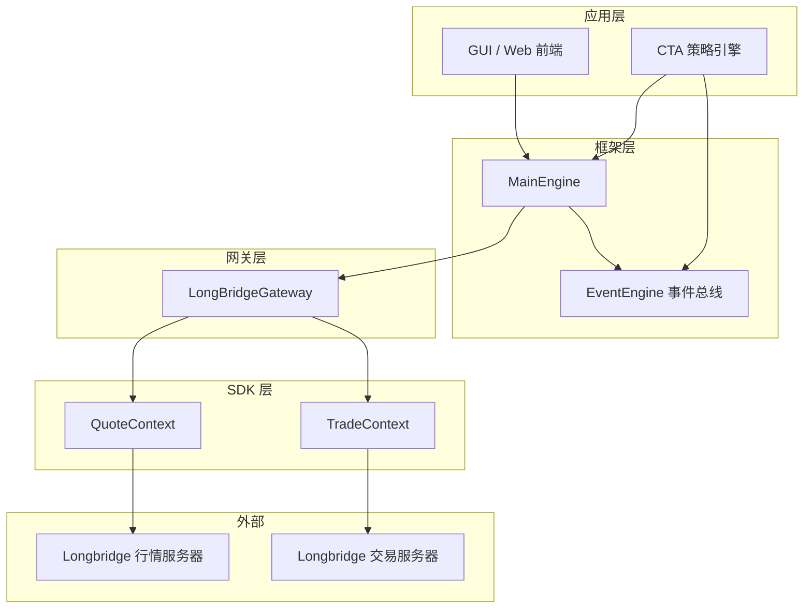
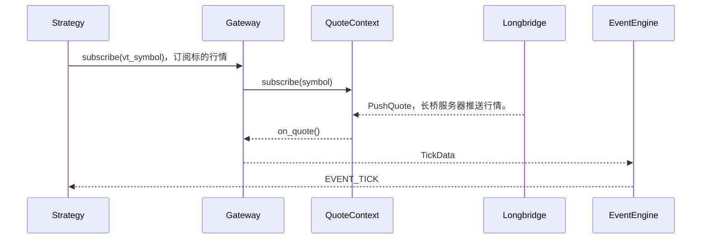
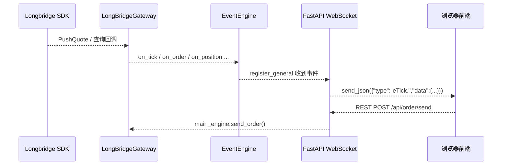

# 个人登陆信息（秘）

## 配置Longbridge Developers认证方式一：OAuth 2.0（推荐）
执行以下命令注册 OAuth 客户端，获取 client_id：
```shell
$body = @{
    redirect_uris                = @("http://localhost:60355/callback")
    token_endpoint_auth_method   = "none"
    grant_types                  = @("authorization_code", "refresh_token")
    response_types               = @("code")
    client_name                  = "My Longbridge OpenAPI"
} | ConvertTo-Json

Invoke-RestMethod -Method POST `
    -Uri "https://openapi.longbridge.com/oauth2/register" `
    -ContentType "application/json" `
    -Body $body
```
响应示例：
```json
{
  "client_id": "72d9caaf-0bd4-4000-85a7-8c7978c74544",
  "client_id_issued_at": 1773311221,
  "client_secret_expires_at": 1773314821,
  "client_name": "My Longbridge OpenAPI",
  "redirect_uris": ["http://localhost:60355/callback"],
  "grant_types": ["authorization_code", "refresh_token"],
  "token_endpoint_auth_method": "none",
  "response_types": ["code"],
  "registration_access_token": "BVlMLEtNUUu4FoRFNItC2FfeR/rLpqLNyEuCJNNTCWE=",
  "registration_client_uri": "https://openapi.longbridge.com/oauth2/register/72d9caaf-0bd4-4000-85a7-8c7978c74544"
}
```
保存 client_id 供后续使用。

---

接着，授权并获取token：
SDK 提供内置 OAuth 支持。使用 OAuthBuilder 完成浏览器授权流程，授权后使用 Config.from_oauth() 创建配置。Token 会自动持久化，过期时自动刷新。

Token 存储路径： macOS/Linux 为 ~/.longbridge/openapi/tokens/<client_id>，Windows 为 %USERPROFILE%\.longbridge\openapi\tokens\<client_id>。
```python
from longbridge.openapi import Config, OAuthBuilder

oauth = OAuthBuilder("your-client-id").build(
    lambda url: print(f"请访问此 URL 进行授权：{url}")
)
config = Config.from_oauth(oauth)
```

# 源码分析
## 行情（tick）推送的链路

> 注：本节讲的是**实时行情（Quote）**推送，即长桥 SDK 的 `PushQuote` 回调。K线数据走的是另一条路（`subscribe_candlesticks` + `handle_candlestick`），且当前 `handle_candlestick` 是空实现，并不推送。

### 组件结构



### 消息推送链路

长桥的行情不是"前端主动拉取"，而是**服务器推送**。完整链路如下：

1. 网关启动时通过 `quote_ctx.set_on_quote(self.handle_quote)` 告诉 SDK：有行情来了就回调 `handle_quote`。
2. 订阅行情：`quote_ctx.subscribe(symbols, [SubType.Quote, SubType.Depth])`，订阅实时报价和盘口深度，长桥服务器保持长连接持续推送。
3. 服务器有行情变化时，主动 `PushQuote`，SDK 自动回调 `handle_quote(symbol, quote)`。
4. `handle_quote` 内部调用 `quote_ctx.realtime_depth(symbol)` 补上盘口五档，构造 `TickData`（最新价、成交量、五档买卖价等），再调用 `self.on_tick(tick)`。
5. `on_tick` 走 `BaseGateway.on_event`：把 `TickData` 包装成 `Event(type="eTick.", data=tick)`，`put()` 进 `EventEngine` 的线程安全队列（只入队就返回，异步）。
6. `EventEngine` 的工作线程取出事件，分发给所有注册了 `eTick.` 的处理器：MainEngine 缓存最新行情、CTA 策略引擎跑 `on_tick`、Web 的 WebSocket 转发器等。

### 消息流（时序图）



### 时序图逐行解释

时序图展示的是一条**行情（tick）从长桥服务器到策略的完整链路**：

| 步骤 | 消息 | 含义 | 对应代码 |
|------|------|------|---------|
| 1 | `Strategy-->>Gateway: subscribe(vt_symbol)` | 策略引擎向网关发出订阅请求，告诉网关"我要某某合约的行情" | `main_engine.subscribe()` → `gateway.subscribe()` |
| 2 | `Gateway-->>QuoteContext: subscribe(symbol)` | 网关把订阅请求转给长桥 SDK 的 QuoteContext（已把 vnpy 的 vt_symbol 转成长桥格式，如 `AAPL.SMART` → `AAPL.US`） | `convert_symbol_vt2lb()` + `quote_ctx.subscribe()` |
| 3 | `Longbridge-->>QuoteContext: PushQuote` | 长桥服务器主动推送实时行情（服务器回调，非请求-响应） | SDK 内部 |
| 4 | `QuoteContext-->>Gateway: on_quote()` | SDK 回调网关的 `handle_quote`，网关拿到行情数据并构造 `TickData`（最新价、盘口五档、成交量等） | `set_on_quote(self.handle_quote)` |
| 5 | `Gateway-->>EventEngine: TickData` | 网关把 `TickData` 包装成 Event（`type="eTick."`）`put()` 进 EventEngine 的线程安全队列。`-->>` 表示**异步**：只是入队就返回，不等待处理 | `on_tick(tick)` → `on_event(EVENT_TICK, tick)` → `event_engine.put(event)` |
| 6 | `EventEngine-->>Strategy: EVENT_TICK` | EventEngine 的工作线程从队列取出事件，分发给所有注册了 `eTick.` 的处理器（策略引擎、MainEngine 缓存、Web 转发器等），策略的 `on_tick()` 被调用 | `event_engine.register(EVENT_TICK, ...)` |

**重点理解第 5 步**：`Gateway-->>EventEngine: TickData` 只是"网关把最新行情推送给事件总线"。整条链路是**异步解耦**的——网关不直接调用策略，只往队列里丢事件；EventEngine 再用自己的工作线程分发给各方，互不阻塞。

## 下单（send_order）调用链

`send_order` 是策略下单到券商成交的完整调用链。以买入 `self.buy(price, volume)` 为例。

### 调用链总览

```
策略 buy()  →  CtaTemplate.send_order()        [template.py:143/227]
                    │ 检查 trading
                    ▼
             CtaEngine.send_order()            [engine.py:466]
                    │ 取合约、round 价格/数量、stop 分流
                    ▼
             send_limit_order()  →  send_server_order()   [engine.py:338/283]
                    │ 构造 OrderRequest、convert_order_request
                    ▼
             MainEngine.send_order(req, gateway)   [vnpy trader/engine.py]
                    │ 按名称找网关
                    ▼
             LongBridgeGateway.send_order()        [longbridge_gateway.py:292]
                    │ 平仓检查 / pending 检查 / 类型映射
                    ▼
             trade_ctx.submit_order(...)           [长桥 SDK]
                    │
                    ▼
             order_id 原路返回：gateway → engine → 策略
```

### 各层职责

**① 策略层 `CtaTemplate`（template.py）**

```python
def buy(self, price, volume, stop=False, lock=False, net=False):   # :143
    return self.send_order(Direction.LONG, Offset.OPEN, price, volume, stop, lock, net)

def send_order(self, direction, offset, price, volume, stop, lock, net):  # :227
    if self.trading:                                    # 不在交易状态就不发单
        return self.cta_engine.send_order(self, direction, offset, price, volume, stop, lock, net)
    else:
        return []
```

四个开平动作映射：`buy`→LONG/OPEN、`sell`→SHORT/CLOSE、`short`→SHORT/OPEN、`cover`→LONG/CLOSE。

**② 引擎层 `CtaEngine.send_order`（engine.py:466）**

```python
contract = self.main_engine.get_contract(strategy.vt_symbol)   # 拿合约（pricetick 等）
price = round_to(price, contract.pricetick)                      # 价格对齐最小变动单位
volume = round_to(volume, contract.min_volume)                   # 数量对齐最小交易单位

if stop:                          # 止损单分流
    if contract.stop_supported:   # 券商支持 → 服务器止损单
        return self.send_server_stop_order(...)
    else:                         # 否则 → 本地模拟止损单
        return self.send_local_stop_order(...)
else:
    return self.send_limit_order(...)    # 普通限价单
```

**③ `send_server_order`（engine.py:283）** — 实际构造请求并发送

```python
original_req = OrderRequest(symbol, exchange, direction, offset, type, price, volume,
                            reference=f"{APP_NAME}_{strategy.strategy_name}")  # 标记来源策略
req_list = self.main_engine.convert_order_request(original_req, gateway_name, lock, net)  # 可能拆单
for req in req_list:
    vt_orderid = self.main_engine.send_order(req, contract.gateway_name)   # 发单
    self.orderid_strategy_map[vt_orderid] = strategy                        # 记录：订单→策略
    self.strategy_orderid_map[strategy.strategy_name].add(vt_orderid)      # 记录：策略→订单集合
```

这两个记录是**回调路由的关键**——长桥订单状态推回来时，靠它们找到对应策略。

**④ 网关层 `LongBridgeGateway.send_order`（longbridge_gateway.py:292）**

```python
symbol = convert_symbol_vt2lb(req.symbol, req.exchange)    # AAPL.SMART → AAPL.US

# 平仓单：先确认有持仓可平，没有就忽略
if req.offset == Offset.CLOSE:
    if not has_position: return ""                          # 返回空 = 拒单

# 防重复：同一标的已有挂单就忽略，返回已存在订单号
if pending_orders: return pending_orders[0].order_id

order_type = ORDER_TYPE_VN2LB[req.type]                     # LIMIT/MARKET/STOP → 长桥类型
# 价格处理：STOP 传 trigger_price，MARKET 不传价，LIMIT 传 submitted_price
resp = self.trade_ctx.submit_order(symbol, order_type, side=..., quantity=..., ...)
return resp.order_id
```

### 返回值的两次"变装"

1. **引擎 → 策略**：`send_limit_order` 返回 `[vt_orderid]`（列表）。`vt_orderid` 带网关前缀（`LongBridge.xxx`），是 vnpy 全局唯一 id。
2. **网关 → 引擎**：`submit_order` 返回长桥原生 `order_id`（不带前缀），vnpy 封装成 `vt_orderid`。

### 异步回调闭环

下单后不是同步拿到成交，而是靠事件回调：

```
长桥推送 / 轮询 → query_order() → on_order(OrderData) → MainEngine 缓存
                                                    → CtaEngine.process_order_event
                                                        → orderid_strategy_map 找到策略
                                                            → strategy.on_order(order)
```

策略在 `on_order` 里看 `order.status`（未成交/部分成交/全部成交/已撤销）做后续处理；真正的成交在 `on_trade`。

**一句话总结**：策略判断 → 引擎对齐价格/数量并分流 → 构造 OrderRequest 发到 MainEngine → 网关做业务检查（平仓/防重）→ 长桥 submit_order → 订单号原路返回，状态靠事件异步回调。

# 策略
## 导入策略
在C:\Users\Admin\Desktop\vnpy_longbridge\vnpy_longbridge\lb_strategy_app\engine.py中，load_strategy_class方法是用来加载策略类的，代码里打印了加载扫描路径。
```python
def load_strategy_class(self) -> None:
    pass
```
将C:\Users\Admin\Desktop\vnpy_longbridge\vnpy_longbridge\lb_strategy_app\strategies\boll_channel_strategy.py中
```python
from vnpy_ctastrategy import (
    CtaTemplate,
    StopOrder,
    TickData,
    BarData,
    TradeData,
    OrderData,
    BarGenerator,
    ArrayManager,
)
```
改为：
```python
from vnpy_longbridge.lb_strategy_app import (
    CtaTemplate,
    StopOrder,
    TickData,
    BarData,
    TradeData,
    OrderData,
    BarGenerator,
    ArrayManager,
)
```
则项目启动后就能找到BollChannelStrategy策略类了。

---

# 源码分析：为什么复制 lb_strategy_app 进项目

## 背景

`vnpy_longbridge/lb_strategy_app/` 并不是第三方库的一部分被"复制"进来，而是 **vnpy 官方 CTA 策略 App（vnpy_ctastrategy）整个拷贝后改名的本地副本**，从项目第一个提交就存在。

## 复制后改了哪些东西

| 改动点 | 位置 | 目的 |
|---|---|---|
| 策略加载路径 | `engine.py` 的 `load_strategy_class()` | 官方版只从 `vnpy_ctastrategy/strategies` 和 `cwd/strategies` 加载策略；fork 后改为扫描本包内的 `strategies/` 目录，让项目自带策略开箱可用 |
| App 注册名 | `LbStrategyApp.app_module = "vnpy_longbridge.lb_strategy_app"` | 打包成项目自带组件，不依赖单独安装的 vnpy_ctastrategy App |
| UI 定制 | `ui/widget.py` | fork 版加了官方版没有的"移仓助手"（`ui/rollover.py`） |

## 当前存在的混用矛盾

引擎和策略模板是**两套 CtaTemplate**，混在一起用：

- 策略文件（`strategies/*.py`）import 的是**官方**类：
  ```python
  from vnpy_ctastrategy import (CtaTemplate, StopOrder, ...)
  ```
- fork 引擎 `engine.py` 加载策略时，判断 `issubclass(value, CtaTemplate)` 用的是**本地**类：
  ```python
  from .template import CtaTemplate   # engine.py 第55行
  ```

这是两个完全不同的类，`issubclass` 可能返回 False，导致策略类加载不进来。修复方式见上文"导入策略"一节——把策略文件的 import 统一改成从本地包导入即可。

## 小结

复制的原因归结为一点：**让本项目自带 CTA 策略引擎和策略，且能本地定制**。但复制时没有把策略模板的引用一并替换，留下了混用的隐患，需要统一成一套。

---

# 源码分析：引擎（Engine）概念

## 什么是引擎

**引擎 = 一个独立运转的核心逻辑模块，自己会干活，外界只要告诉它"开始"，剩下的它自己跑。**

类比汽车引擎：踩油门它就跑，内部点火、活塞、传动它自己处理，你只通过方向盘/油门/刹车和它交互。

交易引擎同理：策略引擎（`CtaEngine`）你只要"添加策略、初始化、启动"，它自己负责收行情、算指标、发单、管理持仓。

## 项目里的引擎一览

| 引擎 | 干什么 | 类比 |
|---|---|---|
| `MainEngine` | 总引擎，管理所有网关和子引擎 | 公司总经理 |
| `EventEngine` | 事件总线，收事件、转发给订阅者 | 消息邮局 |
| `CtaEngine` | 实盘策略引擎，跑策略、下单 | 操盘手 |
| `BacktesterEngine` | 回测引擎，用历史数据推演 | 沙盘推演员 |

## 引擎的共同特征

1. **自己维护状态**：内部有各种字典、队列，外界不直接碰
2. **对外只暴露操作接口**：`start()`、`stop()`、`send_order()`——你调用方法，它干活
3. **事件/回调驱动**：行情来了引擎自动响应，不用你轮询
4. **长生命周期**：进程启动时创建，一直运行到结束

## 引擎和普通类的区别：控制反转

普通类：你创建对象，自己调用它每个方法，控制每一步。

引擎类：你把对象交给系统，它**反过来驱动你**——你注册的回调（如 `on_tick`）会被引擎自动调用。**不是你调用引擎，是引擎调用你的回调。**

```python
# 引擎用法——你只管调用高层接口
cta_engine.add_strategy("HuhhStrategy", "my_huhh", "AAPL.SMART", {})
cta_engine.init_strategy("my_huhh")     # 引擎内部加载历史数据、订阅行情
cta_engine.start_strategy("my_huhh")    # 引擎开始跑，行情来了自动调 on_tick
```

## 两类引擎

### 功能引擎 → 继承 `BaseEngine`

`CtaEngine`、`BacktesterEngine`、`OmsEngine`、`LogEngine`、`EmailEngine` 都继承 `BaseEngine`（抽象基类，`vnpy/trader/engine.py:51`）。

继承它获得公共基础设施：
- **构造函数统一**：自动持有 `main_engine` 和 `event_engine` 引用
- **通用方法**：`write_log` 等不用每个引擎重写
- **统一注册接口**：`add_engine(engine_class)` 要求符合 BaseEngine 约定，MainEngine 才能统一管理

### 核心引擎 → 独立类，不继承

`MainEngine`（`class MainEngine:`）和 `EventEngine`（`class EventEngine:`）是独立类。它们是底层，不继承 BaseEngine。

```
BaseEngine (抽象基类)
   ├── CtaEngine          ← 项目实盘引擎
   ├── BacktesterEngine   ← 项目回测引擎
   ├── OmsEngine
   ├── LogEngine
   └── EmailEngine

MainEngine   （独立，管理上面的 BaseEngine 们）
EventEngine  （独立，被 BaseEngine 们使用）
```

## MainEngine 如何创建引擎

```python
# MainEngine.add_engine()
engine = engine_class(self, self.event_engine, name)  # 创建引擎，把 self 传进去
self.engines[name] = engine                            # 存起来
```

本质就两件事：
1. MainEngine 有个 `add_engine()` 方法，创建引擎并存起来
2. 创建时把 `self` 传给引擎，引擎以后想用 MainEngine 就能用（`self.main_engine.send_order()`）

所以**引擎创建后能反过来用 MainEngine 的功能**——这是"MainEngine 反过来被功能引擎依赖"的含义：管理方向是 MainEngine → 引擎，但运行时调用方向是引擎 → MainEngine。

## 引擎能创建什么

| 引擎 | 创建 | 方法 |
|---|---|---|
| `MainEngine` | 网关、功能引擎 | `add_gateway()`、`add_engine()` |
| `CtaEngine` | 策略实例、止损单、交易请求 | `add_strategy()`、`send_local_stop_order()` |
| `BacktesterEngine` | 回测核心引擎 | `init_engine()` |
| `EventEngine` | 事件对象、后台线程 | `put()`、`start()` |

**核心原则**：引擎只创建它"自己负责管理"的东西，不创建别的引擎该管的东西——各管各的，职责清晰。

---

# 源码分析：实盘引擎与回测引擎的区别

`lb_strategy_app/engine.py`（实盘）和 `lb_strategy_app/backtester/engine.py`（回测）都叫 `engine.py`，但职责完全不同——**一个管实盘、一个管回测**，模拟的是同一种交易，运行方式却不一样。

## 为什么都叫 engine.py

- 这是 **vnpy 的命名约定**：每个 App 的核心引擎文件都叫 `engine.py`
- 它们在不同包里，Python 用包路径区分，同名不会冲突：
  ```python
  from vnpy_longbridge.lb_strategy_app.engine import CtaEngine                 # 实盘
  from vnpy_longbridge.lb_strategy_app.backtester.engine import BacktesterEngine  # 回测
  ```
- 真正用的是**类名**（`CtaEngine` vs `BacktesterEngine`），文件名只是存放位置

## 核心区别

| 维度 | `engine.py` (CtaEngine) | `backtester/engine.py` (BacktesterEngine) |
|---|---|---|
| **本质** | 实盘运行 | 回测调度（外包给 `backtesting.py`） |
| `engine_type` | `EngineType.LIVE` | 内部用 `EngineType.BACKTESTING` |
| **数据来源** | 真实网关实时行情（tick/bar 推送） | 历史数据回放（`load_bar_data` 从数据库/数据源拉取） |
| **下单** | `main_engine.send_order()` → 券商真单 | 调用 `backtesting.py` 的 `BacktestingEngine.run_backtesting()`，模拟撮合 |
| **事件驱动** | 注册 `EVENT_TICK/ORDER/TRADE` 响应真实事件 | 不响应真实事件，按回放时序驱动策略 |
| **策略生命周期** | add/init/start/stop 策略，含持久化（JSON） | `load_strategy_class` 加载策略类 + `run_backtesting` 一次性跑 |
| **参数** | 无费率概念 | 回测区间、手续费 rate、滑点 slippage、合约乘数 size、初始资金 capital |
| **运行方式** | 常驻，一直跑 | 后台 `Thread` 跑一次，完成后发 `EVENT_BACKTESTER_*` 事件通知 UI |
| **结果** | 实时推送持仓/成交到 UI | `result_df`、`result_statistics`（总收益/夏普等）、`result_values`（优化结果） |
| **UI** | `CtaManager`（策略管理） | `BacktesterManager`（回测界面） |

## 关键架构点

`backtester/engine.py` 本身**不写撮合逻辑**——它是"调度器"，核心回测逻辑在 `backtesting.py` 的 `BacktestingEngine` 里：

```python
# backtester/engine.py
self.backtesting_engine = BacktestingEngine()   # 真正干活的
engine.set_parameters(...)                       # 设回测参数
engine.add_strategy(strategy_class, setting)     # 挂策略
engine.load_data()                               # 拉历史数据
engine.run_backtesting()                         # 模拟撮合
```

所以：
- **实盘**：`CtaEngine` 全自主（连网关、收行情、发单）
- **回测**：`BacktesterEngine` 负责调度，`BacktestingEngine`（`backtesting.py`）负责撮合，两文件配合

一句话总结：**`engine.py` 是"上战场打仗"，`backtester/engine.py` 是"用历史数据推演沙盘"**，后者不碰真钱。

## 目录结构

重构后回测文件已收进 `backtester/` 子包：

```
lb_strategy_app/
├── engine.py                 (实盘 CtaEngine)
├── template.py               (CtaTemplate)
├── ui/                       (实盘 UI)
├── strategies/               (策略类)
└── backtester/               (回测子包)
    ├── backtesting.py        (BacktestingEngine，撮合核心)
    ├── engine.py             (BacktesterEngine，调度)
    └── ui/                   (回测 UI)
```
---

# Web 交易页面（FastAPI + WebSocket + 轻量前端）

## 概述

为项目新增了基于 FastAPI 的 Web 交易界面，支持**交互操作**（策略启停、手动下单、撤单）和实时数据展示（持仓、委托、成交、账户资金、日志）。

技术选型：
- **后端**：FastAPI + uvicorn（veighna_studio 自带，无需新增依赖）
- **实时推送**：WebSocket，通过 vnpy `EventEngine.register_general()` 监听所有事件，桥接到 asyncio 推给前端
- **前端**：单文件 HTML + vanilla JS + fetch + WebSocket，不引入任何前端框架

## 架构

```
vnpy EventEngine (同步线程)
       │
       │ register_general(event_handler)
       ▼
  event_handler() ──call_soon_threadsafe──► asyncio.Queue
                                                 │
                                                 ▼
                                          WebSocket.send_json()
```




## 新增文件

```
vnpy_longbridge/web/
├── __init__.py     # 暴露 create_app(main_engine, event_engine)
├── server.py       # FastAPI app：REST + WebSocket + 事件转发
└── index.html      # 前端 SPA（单文件）
script/web_server.py  # 启动脚本
```

## REST API

| 方法 | 路径 | 用途 |
|------|------|------|
| GET | `/` | 前端页面 |
| GET | `/api/position/list` | 持仓列表（仅 volume ≠ 0） |
| GET | `/api/order/list` | 委托列表 |
| GET | `/api/trade/list` | 成交列表 |
| GET | `/api/account/list` | 账户资金 |
| POST | `/api/order/send` | 下单（symbol/exchange/direction/type/price/volume/offset） |
| POST | `/api/order/cancel` | 撤单（vt_orderid） |
| POST | `/api/subscribe` | 订阅行情 |
| GET | `/api/strategy/list` | 策略列表及状态 |
| POST | `/api/strategy/{name}/init` | 初始化策略 |
| POST | `/api/strategy/{name}/start` | 启动策略 |
| POST | `/api/strategy/{name}/stop` | 停止策略 |

## 关键实现细节

### 事件转发（server.py）
- `_event_handler` 通过 `register_general` 注册，过滤事件类型前缀（`eTick.`/`eOrder.`/`eTrade.`/`ePosition.`/`eAccount.`/`eLog`/CTA 相关），命中才转发
- 转发用 `_loop.call_soon_threadsafe(q.put_nowait, data)` 从 vnpy 同步线程安全地写入每个连接的 asyncio 队列，再在 ws 协程里 send_json
- lifespan 里注册/注销 handler，保证服务启停时事件流正确挂接

### 序列化（to_serializable）
vnpy 数据对象是 dataclass，字段含 Enum / datetime / Decimal，统一转换成 JSON 可序列化结构：Enum → `.value`，datetime → isoformat，dataclass → dict。

### 策略操作
通过 `main_engine.get_engine(APP_NAME)` 拿到 fork 的 `CtaEngine`，直接调用 `init_strategy` / `start_strategy` / `stop_strategy`，读取 `engine.strategies` 字典返回状态。

### 下单/撤单
- 下单：构造 `OrderRequest`，`main_engine.send_order(req, "LongBridge")` 返回 vt_orderid
- 撤单：`main_engine.get_order(vt_orderid)` 拿 OrderData，再 `order.create_cancel_request()` 构建 CancelRequest

## 启动方式

```bash
python script/web_server.py
```

启动流程：
1. 创建 EventEngine / MainEngine
2. 注册 LongBridgeGateway，设置 currency、main_engine、after_connect（订阅行情）
3. `gw.connect({})` 建立长桥连接（OAuth 授权 URL 会打印到控制台）
4. `main_engine.add_app(LbStrategyApp)` 注册策略引擎
5. `create_app()` 创建 FastAPI，uvicorn 监听 0.0.0.0:8000

浏览器访问 `http://localhost:8000`（局域网内其他设备用 `http://<内网IP>:8000`）。

**注意**：`0.0.0.0` 是 uvicorn 的绑定地址，不是访问地址，客户端访问必须用具体 IP 或 localhost。

## 前端面板

- **顶部栏**：账户资金概览（balance / frozen / available），WebSocket 连接状态指示灯
- **左侧**：策略列表（init/start/stop 按钮 + 状态 + 变量）+ 下单表单
- **右侧**：三个 Tab —— Positions / Orders / Trades 实时表格
- **底部**：实时日志流（上限 200 条）

页面打开时先通过 REST 拉一次全量数据，之后靠 WebSocket 增量更新；每 10 秒还会全量刷新一次兜底。

## vendor 目录（第三方前端库）

```
vnpy_longbridge/web/vendor/
└── lightweight-charts.standalone.production.js   (196 KB, v5.2.0)
```

### vendor/ 是什么

"vendor" 直译为"供应商"，是 Web 开发里存放**第三方依赖（非自己写的代码）**的目录约定。

### 里面的文件做什么

`lightweight-charts.standalone.production.js` 是 **TradingView 官方的 Lightweight Charts 图表库**（开源，Apache 2.0），用于在浏览器绘制 K 线图（蜡烛图、成交量等）。它提供全局 `LightweightCharts` 对象，`index.html` 用它：

```js
chart = LightweightCharts.createChart(...)                                  // 创建图表
candleSeries = chart.addSeries(LightweightCharts.CandlestickSeries, {...})  // 画蜡烛
volumeSeries = chart.addSeries(LightweightCharts.HistogramSeries, {...})    // 画成交量
```

### 为什么放本地而不是用 CDN

1. 最初用 CDN（`unpkg.com`）加载，但当前网络环境访问这些 CDN 超时不可达
2. 确认网络环境需走代理才能访问外网，而 web 服务**不能全局设代理**（`http_proxy` 环境变量会破坏长桥 SDK 连接，实测长桥报 `10054 远程主机强制关闭连接`）
3. 所以把库**下载到项目本地**，页面引用 `/vendor/...`，完全脱离外网依赖

`web/server.py` 有对应静态挂载，让浏览器能访问该文件：

```python
vendor_path = Path(__file__).parent / "vendor"
app.mount("/vendor", StaticFiles(directory=str(vendor_path)), name="vendor")
```

### 版本与 API 注意

- 当前是 **v5.2.0**，使用 **v5 API**：`chart.addSeries(LightweightCharts.CandlestickSeries, ...)`
- **v4 及以前的旧 API 在 v5 已移除**：`chart.addCandlestickSeries(...)` / `chart.addHistogramSeries(...)`，调用会报 `addCandlestickSeries is not a function`
- 升级/替换库文件时，需同步检查 `index.html` 里的图表 API 是否匹配
- 品牌 logo（点击跳 TradingView 网站）通过 CSS 隐藏：`#chart-container #tv-attr-logo { display: none; }`

### 维护建议

- 该文件应**提交进 git**（删了图表功能就失效）
- 如网络条件允许，也可改回 CDN 加载；本地加载最稳妥，不依赖外网


